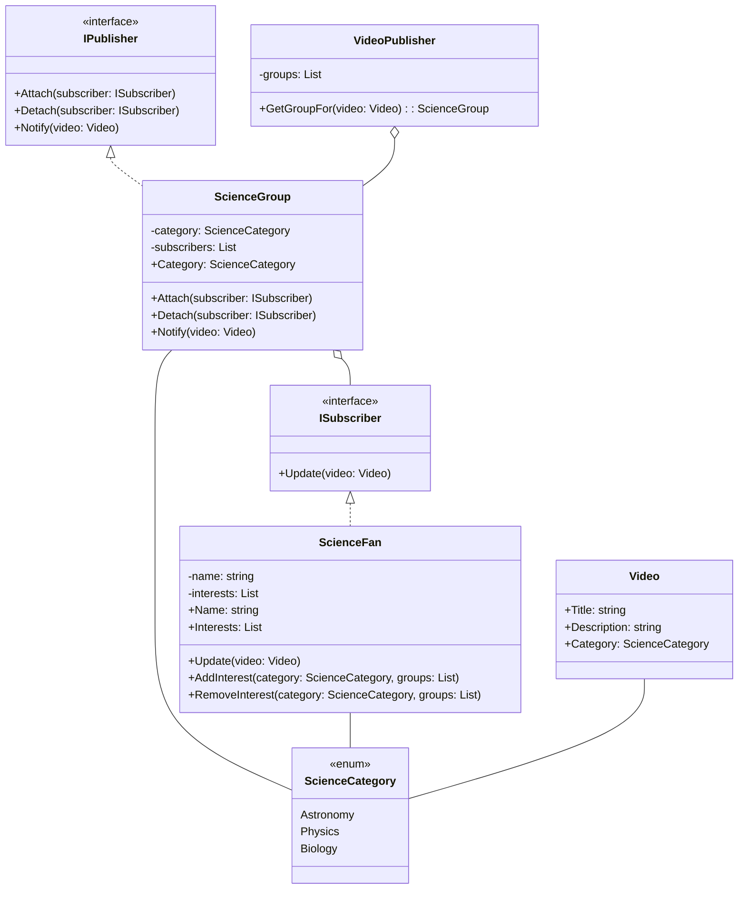
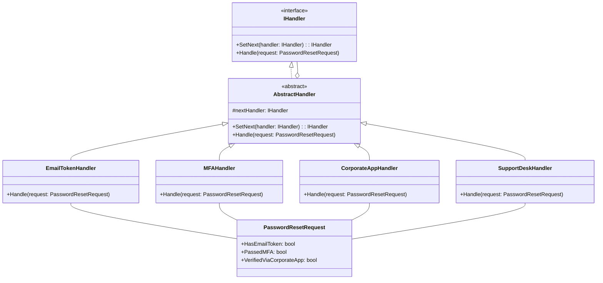
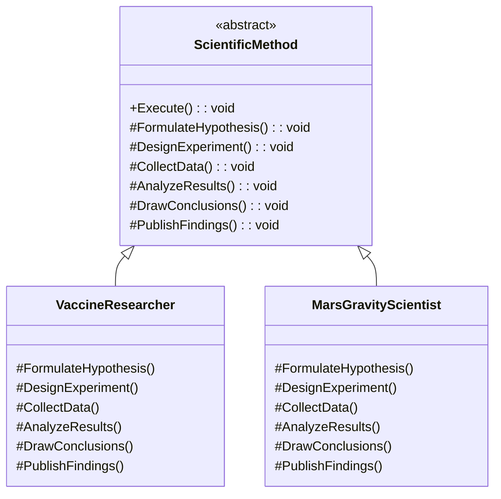

# Trabajo de Diseño de patrones y diseño de software - Patrones de comportamiento

### Integrantes: 
 #### - Wilson Andrés Vargas Rojas
 #### - Yeison Fabian Suarez Alba 

## Definición del problema 1 que se desean abordar:

un grupo de aficionados cientificos quiere en su club ver videos de canales de YouTube de ciencia, sin embargo, no todos tienen el mismo interés cientifico, es decir no a todos les gusta la astronomía, la biología o la física, por lo que deciden crear un algoritmo que solo les envié los videos que quieren recibir con los temas cientificos interés.

Queriendo tener este comportamiento se plantean usar el patrón Observer.

Lo primero es definir las categorías cientificas de los videos que se quiere recibir, se hace el uso de enum para respetar el principio SOLID de abierto/cerrado:


```C#
public enum ScienceCategory
    {
        Astronomy,
        Physics,
        Biology,
        Chemistry,
        Geology
    }

```


Después de esto se define la clase video:


```C#
public class Video
    {
        public string ChannelName { get; }
        public string Title { get; }
        public ScienceCategory Category { get; }

        public Video(string channelName, string title, ScienceCategory category)
        {
            ChannelName = channelName;
            Title = title;
            Category = category;
        }
    }
```

### La interfaz subscriptora
Con el fin de que se puedan crear diferentes maneras de subcripción, no solamente de videos, si no de revistas, congresos y demás, se crea la interfaz subcriptora, aunque unicamente lo estemos usando para los videos, entendemos las necesidades de expanción del club. En la mayoría de casos solo se usa el método actualizar y este caso no es la excepción.


```C#
    public interface IObserver
    {
        void Update(Video video);
    }
```

Sin embargo como queremos agrupar es por afición cientifica de interés, se crean los grupos cientificos con aquellos videos según su contenido, mediante una interfaz y así cumpliendo con el principio SOLID de Segregación de interfaces.


```C#
public interface ISubject
    {
        void Register(IObserver observer);
        void Unregister(IObserver observer);
        void Notify(Video video);
    }

```

### El notificador o publisher
Ahora bien el notificador usará la interfaz para gestionar las subscripciones de los integrantes a los grupos cientificos de interés:


```C#
public class ScienceGroup : ISubject
    {
        private readonly List<IObserver> _members = new List<IObserver>();
        public ScienceCategory Category { get; }

        public ScienceGroup(ScienceCategory category)
        {
            Category = category;
            Console.WriteLine($"[Sistema] Grupo de interés creado para: {Category}");
        }

        public void Register(IObserver observer)
        {
            _members.Add(observer);
            Console.WriteLine($"[Acción] Miembro suscrito al grupo {Category}");
        }

        public void Unregister(IObserver observer)
        {
            _members.Remove(observer);
            Console.WriteLine($"[Acción] Miembro dado de baja del grupo {Category}");
        }

        public void Notify(Video video)
        {
            Console.WriteLine($"[Grupo {Category}] Notificando miembros sobre: '{video.Title}' de {video.ChannelName}");
            foreach (var member in _members)
            {
                member.Update(video);
            }
        }
    }
```

### Los subscriptores concretos
Para el patrón Observer los suscriptores Concretos realizan algunas acciones en respuesta a las notificaciones emitidas por el notificador. Todas estas clases deben implementar la misma interfaz de forma que el notificador no esté acoplado a clases concretas, en este caso los miembros del grupo de ciencia.


```C#
public class ScienceFan : IObserver
{
    public string Name { get; }
    public List<ScienceCategory> Interests { get; }

    public ScienceFan(string name, IEnumerable<ScienceCategory> interests)
    {
        Name = name;
        Interests = new List<ScienceCategory>(interests);
        Console.WriteLine($"[Usuario] {Name} creado con intereses: {string.Join(", ", Interests)}");
    }

    // Método para agregar un nuevo interés y suscribirse al grupo correspondiente
    public void AddInterest(ScienceCategory newInterest, IEnumerable<ScienceGroup> availableGroups)
    {
        if (!Interests.Contains(newInterest))
        {
            Interests.Add(newInterest);
            Console.WriteLine($"[Usuario] {Name} ha añadido un nuevo interés: {newInterest}");

            // Registrar al miembro en el grupo correspondiente
            var group = availableGroups.FirstOrDefault(g => g.Category == newInterest);
            group?.Register(this); // Suscribir al grupo
        }
    }

    // Método para eliminar un interés y desuscribirse del grupo correspondiente
    public void RemoveInterest(ScienceCategory category, IEnumerable<ScienceGroup> availableGroups)
    {
        if (Interests.Remove(category))
        {
            var group = availableGroups.FirstOrDefault(g => g.Category == category);
            group?.Unregister(this); // Desuscribir del grupo
            Console.WriteLine($"[Usuario] {Name} ha eliminado el interés: {category}");
        }
    }

    // Método para recibir notificaciones de los videos
    public void Update(Video video)
    {
        Console.WriteLine($"  -> [Notificación] {Name} recibe: '{video.Title}' de {video.ChannelName} [{video.Category}]");
    }

    // Método que devuelve los intereses del usuario (los grupos a los que está suscrito)
    public void PrintInterests()
    {
        Console.WriteLine($"Miembro: {Name}");
        Console.WriteLine("  Grupos de interés:");
        foreach (var interest in Interests)
        {
            Console.WriteLine($"    - {interest}");
        }
    }
}

```

Ahora definamos un objeto que se encargue de hacer la administración de que videos pertenecen a que grupo, que va a actuar como clasificador de los videos.


```C#
public class VideoPublisher
    {
        private readonly Dictionary<ScienceCategory, ScienceGroup> _groups;

        public VideoPublisher(IEnumerable<ScienceGroup> groups)
        {
            _groups = new Dictionary<ScienceCategory, ScienceGroup>();
            foreach (var group in groups)
            {
                _groups[group.Category] = group;
            }
        }

        public ScienceGroup GetGroupFor(Video video)
        {
            if (_groups.TryGetValue(video.Category, out var group))
            {
                return group;
            }
            return null;
        }
    }
```

Finalmente probemos como funciona el clasificador de videos:


```C#
// Inicializar grupos de interés
var groups = new List<ScienceGroup>
{
    new ScienceGroup(ScienceCategory.Astronomy),
    new ScienceGroup(ScienceCategory.Physics),
    new ScienceGroup(ScienceCategory.Biology)
};

// Inicializar miembros del club con intereses (cada uno se suscribe automáticamente al agregar intereses)
var members = new List<ScienceFan>
{
    new ScienceFan("Wilson Vargas", new List<ScienceCategory>()),
    new ScienceFan("María López", new List<ScienceCategory>())
};

// Asignar intereses usando el método que también suscribe
members[0].AddInterest(ScienceCategory.Astronomy, groups);
members[0].AddInterest(ScienceCategory.Physics, groups);

members[1].AddInterest(ScienceCategory.Biology, groups);

// Clasificador de videos para el grupo
var publisher = new VideoPublisher(groups);

// Videos obtenidos
var videos = new List<Video>
{
    new Video("Cosmos Científico", "Explosiones de supernovas", ScienceCategory.Astronomy),
    new Video("Física para Todos", "La paradoja de los gemelos", ScienceCategory.Physics),
    new Video("BioCurioso", "Mutaciones genéticas raras", ScienceCategory.Biology)
};

// Notificar a los grupos los videos
foreach (var video in videos)
{
    Console.WriteLine($"[Programa] Procesando video: '{video.Title}' (Categoría: {video.Category})");

    // Determinar el grupo al que pertenece el video
    var group = publisher.GetGroupFor(video);
    if (group != null)
    {
        Console.WriteLine($"[Programa] Notificando al grupo {group.Category}");
        group.Notify(video);
    }
    else
    {
        Console.WriteLine($"[Programa] No hay grupo para la categoría {video.Category}. Video ignorado.");
    }
}

```

    [Sistema] Grupo de interés creado para: Astronomy
    [Sistema] Grupo de interés creado para: Physics
    [Sistema] Grupo de interés creado para: Biology
    [Usuario] Wilson Vargas creado con intereses: 
    [Usuario] María López creado con intereses: 
    [Usuario] Wilson Vargas ha añadido un nuevo interés: Astronomy
    [Acción] Miembro suscrito al grupo Astronomy
    [Usuario] Wilson Vargas ha añadido un nuevo interés: Physics
    [Acción] Miembro suscrito al grupo Physics
    [Usuario] María López ha añadido un nuevo interés: Biology
    [Acción] Miembro suscrito al grupo Biology
    [Programa] Procesando video: 'Explosiones de supernovas' (Categoría: Astronomy)
    [Programa] Notificando al grupo Astronomy
    [Grupo Astronomy] Notificando miembros sobre: 'Explosiones de supernovas' de Cosmos Científico
      -> [Notificación] Wilson Vargas recibe: 'Explosiones de supernovas' de Cosmos Científico [Astronomy]
    [Programa] Procesando video: 'La paradoja de los gemelos' (Categoría: Physics)
    [Programa] Notificando al grupo Physics
    [Grupo Physics] Notificando miembros sobre: 'La paradoja de los gemelos' de Física para Todos
      -> [Notificación] Wilson Vargas recibe: 'La paradoja de los gemelos' de Física para Todos [Physics]
    [Programa] Procesando video: 'Mutaciones genéticas raras' (Categoría: Biology)
    [Programa] Notificando al grupo Biology
    [Grupo Biology] Notificando miembros sobre: 'Mutaciones genéticas raras' de BioCurioso
      -> [Notificación] María López recibe: 'Mutaciones genéticas raras' de BioCurioso [Biology]


Ahora supongamos que uno de los miebros ha encontrado un nuevo interés cientifico y a su vez, ha ingresado un nuevo miembro al club, entonces para esto se tendría que atualizar las subscripciones, para la proxima entrega se tendría.

Actualmente se tiene que para los miembros son y se interesan por:


```C#
foreach (var member in members)
{
    Console.WriteLine($"Miembro: {member.Name}");
    Console.WriteLine("  Grupos de interés:");
    foreach (var interest in member.Interests)
    {
        Console.WriteLine($"    - {interest}");
    }
}
```

    Miembro: Wilson Vargas
      Grupos de interés:
        - Astronomy
        - Physics
    Miembro: María López
      Grupos de interés:
        - Biology


Además de que tenemos los siguientes grupos:

ahora se añade una nueva preferencia para María y un nuevo miembro al grupo que se va a subscribir a todo, a demás Wilson se va desubcribir de física ya que no le da tiempo de ver este tema:


```C#
// Añadiendo un nuevo interés a María
var maria = members.First(m => m.Name == "María López");
maria.AddInterest(ScienceCategory.Physics, groups);  // Se suscribe automáticamente al grupo de Física

// Creando un nuevo integrante (José Ramírez) y suscribiéndolo a todos los grupos
var jose = new ScienceFan("José Ramírez", Enum.GetValues(typeof(ScienceCategory)).Cast<ScienceCategory>());
members.Add(jose);

// Suscribir a José automáticamente a todos los grupos según sus intereses
foreach (var group in groups)
{
    if (jose.Interests.Contains(group.Category))  // Sólo se suscribe a los grupos de los intereses que tiene
    {
        group.Register(jose);
    }
}

// Quitar a Wilson del grupo de Física
var wilson = members.First(m => m.Name == "Wilson Vargas");
wilson.RemoveInterest(ScienceCategory.Physics, groups);  // Elimina el interés y se desuscribe del grupo de Física

```

    [Usuario] María López ha añadido un nuevo interés: Physics
    [Acción] Miembro suscrito al grupo Physics
    [Usuario] José Ramírez creado con intereses: Astronomy, Physics, Biology, Chemistry, Geology
    [Acción] Miembro suscrito al grupo Astronomy
    [Acción] Miembro suscrito al grupo Physics
    [Acción] Miembro suscrito al grupo Biology
    [Acción] Miembro dado de baja del grupo Physics
    [Usuario] Wilson Vargas ha eliminado el interés: Physics


Una vez actualizados los miembros y sus grupos de interés se tiene:


```C#
foreach (var member in members)
{
    Console.WriteLine($"Miembro: {member.Name}");
    Console.WriteLine("  Grupos de interés:");
    foreach (var interest in member.Interests)
    {
        Console.WriteLine($"    - {interest}");
    }
}
```

    Miembro: Wilson Vargas
      Grupos de interés:
        - Astronomy
    Miembro: María López
      Grupos de interés:
        - Biology
        - Physics
    Miembro: José Ramírez
      Grupos de interés:
        - Astronomy
        - Physics
        - Biology
        - Chemistry
        - Geology


### Diagrama UML:





## Definición del problema 2 que se desean abordar:

El soporte técnico de una empresa decidió implementar una solución para el restablecimiento de contraseñas de sus aplicativos empresariales, sin embargo si el usuario no es capaz de resolver el problema por esos medios, ellos deben actuar, usualmente ocurre muy esporadicamente ya que los métodos de restablecimiento son muy efectivos y seguros.

Para esta solución implementaron un patrón de Chain of Responsability y para entenderlo se va a plantear un caso de alguién usando el sistema.

Existe un empleado que a raíz de la inseguridad le robaron sus pertenencias, entre ellos su computador y celular de trabajo, el quiere restablecer sus accesos para evitar que la información de la empresa caiga en malas manos por lo que decide hacer el proceso de restablecimiento.

Nota: cada modo para restablecer la cuenta es un handler.

Lo primero es simular el sistema que pide realizar las validaciones:


```C#
public partial class PasswordResetRequest
    {
        public bool HasEmailToken { get; set; }
        public bool PassedMFA { get; set; }
        public bool VerifiedViaCorporateApp { get; set; }
        public bool NeedsHumanSupport => !HasEmailToken && !PassedMFA && !VerifiedViaCorporateApp;
    }
```


### La interfaz handler
Esta es la interfaz común a todos los handler concretos. Normalmente contiene un único método para manejar solicitudes, pero en ocasiones también puede contar con otro método para establecer el siguiente handler de la cadena, como en este caso:


```C#
public interface IPasswordResetHandler
{
    void SetNext(IPasswordResetHandler next);
    void Handle(PasswordResetRequest request);
}

```

### Hadler Base
El handler base no es más que una clase abstracta que ayuda a implementar los métodos en común y evitar la duplicidad de código, especialemnte para enviar la solicitud al siguiente handler.


```C#
public abstract class PasswordResetHandler : IPasswordResetHandler
{
    protected IPasswordResetHandler Next;

    public void SetNext(IPasswordResetHandler next)
    {
        Next = next;
    }

    public abstract void Handle(PasswordResetRequest request);
}

```

### Handlers concretos
Ahora se definen los modos de restablcimiento:


```C#
// Email token
    public class EmailTokenHandler : PasswordResetHandler
    {
        public override void Handle(PasswordResetRequest request)
        {
            if (request.HasEmailToken)
            {
                Console.WriteLine("[EmailTokenHandler] Contraseña restablecida mediante enlace de correo.");
            }
            else
            {
                Console.WriteLine("[EmailTokenHandler] Sin token de email, pasando al siguiente.");
                Next?.Handle(request);
            }
        }
    }

    // MFA
    public class MFAHandler : PasswordResetHandler
    {
        public override void Handle(PasswordResetRequest request)
        {
            if (request.PassedMFA)
            {
                Console.WriteLine("[MFAHandler] Contraseña restablecida mediante MFA.");
            }
            else
            {
                Console.WriteLine("[MFAHandler] MFA no disponible o fallido, pasando al siguiente.");
                Next?.Handle(request);
            }
        }
    }

    // App corporativa
    public class CorporateAppHandler : PasswordResetHandler
    {
        public override void Handle(PasswordResetRequest request)
        {
            if (request.VerifiedViaCorporateApp)
            {
                Console.WriteLine("[CorporateAppHandler] Contraseña restablecida mediante app corporativa.");
            }
            else
            {
                Console.WriteLine("[CorporateAppHandler] App corporativa no verificada, pasando al siguiente.");
                Next?.Handle(request);
            }
        }
    }

    // Soporte técnico
    public class SupportDeskHandler : PasswordResetHandler
    {
        public override void Handle(PasswordResetRequest request)
        {
            if (request.NeedsHumanSupport)
            {
                Console.WriteLine("[SupportDeskHandler] Derivando al soporte técnico.");
            }
            else
            {
                Console.WriteLine("[SupportDeskHandler] No es necesario escalar.");
            }
        }
    }
```

Teniendo todo listo, se procede a realizar la petición por parte de la persona:


```C#
//Crear los handlers
var emailHandler = new EmailTokenHandler();
var mfaHandler = new MFAHandler();
var corporateAppHandler = new CorporateAppHandler();
var supportHandler = new SupportDeskHandler();

// Construcción del orden de la cadena
emailHandler.SetNext(mfaHandler);
mfaHandler.SetNext(corporateAppHandler);
corporateAppHandler.SetNext(supportHandler);

//Usuario realizando la validación
/*
- No pasa el Email token porque no tiene el MFA de acceso al correo de la empresa porque no tiene su dispositivo celular
- No pasa el MFA por la misma razón
 No pasa la app corporativa por la misma razón
*/

var request = new PasswordResetRequest
{
    HasEmailToken = false,
    PassedMFA = false,
    VerifiedViaCorporateApp = false
};

Console.WriteLine("== Iniciando recuperación de contraseña ==");
emailHandler.Handle(request);
```

    == Iniciando recuperación de contraseña ==
    [EmailTokenHandler] Sin token de email, pasando al siguiente.
    [MFAHandler] MFA no disponible o fallido, pasando al siguiente.
    [CorporateAppHandler] App corporativa no verificada, pasando al siguiente.
    [SupportDeskHandler] Derivando al soporte técnico.


Al final de todo, los modos de recuperación no fueron suficientes y soporte técnico tuvo que ayudar con la restauración de las credenciales, sin embargo este caso les hizo ver que les faltó un modo de verificación y fueron las preguntas de seguridad, ya que así fue que pudieron resolver el conflicto, por lo que añadieron este a la cadena y a su validador:


```C#

public partial class PasswordResetRequest
    {
        public bool HasEmailToken { get; set; }
        public bool PassedMFA { get; set; }
        public bool VerifiedViaCorporateApp { get; set; }
        public bool AnsweredSecurityQuestions { get; set; }
        public bool NeedsHumanSupport => !HasEmailToken && !PassedMFA && !VerifiedViaCorporateApp && !AnsweredSecurityQuestions;
    }


// Crear un nuevo handler
public class SecurityQuestionsHandler : PasswordResetHandler
    {
        public override void Handle(PasswordResetRequest request)
        {
            if (request.AnsweredSecurityQuestions)
            {
                Console.WriteLine("[SecurityQuestionsHandler] Contraseña restablecida con preguntas de seguridad.");
            }
            else
            {
                Console.WriteLine("[SecurityQuestionsHandler] Preguntas de seguridad fallidas o no configuradas, pasando al siguiente.");
                Next?.Handle(request);
            }
        }
    }

//Definir el handler
var securityHandler = new SecurityQuestionsHandler();

//Actualizar la cadena de responsabilidad
emailHandler.SetNext(mfaHandler);
mfaHandler.SetNext(corporateAppHandler);
corporateAppHandler.SetNext(securityHandler);
securityHandler.SetNext(supportHandler);

//Simular el sistema
var request = new PasswordResetRequest
    {
        HasEmailToken = false,
        PassedMFA = false,
        VerifiedViaCorporateApp = false,
        AnsweredSecurityQuestions = true
    };

Console.WriteLine("== Iniciando recuperación de contraseña ==");
emailHandler.Handle(request);

```

    == Iniciando recuperación de contraseña ==
    [EmailTokenHandler] Sin token de email, pasando al siguiente.
    [MFAHandler] MFA no disponible o fallido, pasando al siguiente.
    [CorporateAppHandler] App corporativa no verificada, pasando al siguiente.
    [SecurityQuestionsHandler] Contraseña restablecida con preguntas de seguridad.

### Diagrama UML



## Definición del problema 3 que se desean abordar:
Unos investigadores están realizando diversas investigaciones y cada uno debe aplicar el método cientifico a ellas. El método cientifico es un proceso estructurado universal para obtener conocimiento confiable, por lo que tiene pasos bien definidos, aunque su implementación puede variar según el campo de estudio.

El patrón Template Method es adecuado para este escenario, ya que podemos explicar un flujo regular con algunos pasos personalizados.

### El Template o clase abstracta
Se define la estructura, con la lógica concreta y los métodos abstractos


```C#
public abstract class ScientificMethod
{
    public void Execute()
    {
        Observe();
        FormulateHypothesis();
        Experimentation();
        AnalyzeData();
        DrawConclusion();
        PublishResults();
    }

    protected virtual void Observe()
    {
        Console.WriteLine("[Observación] Se observa un fenómeno interesante.");
    }

    protected abstract void FormulateHypothesis();
    protected abstract void Experimentation();
    protected abstract void AnalyzeData();

    protected virtual void DrawConclusion()
    {
        Console.WriteLine("[Conclusión] Se extrae una conclusión basada en los datos.");
    }

    protected virtual void PublishResults()
    {
        Console.WriteLine("[Publicación] Resultados publicados en una revista científica.");
    }
}

```

El método execute define el flujo común para todos los científicos mientras que las subclases FormulateHypothesis, Experimentation, etc, definen los pasos especificos según el campo de estudio.

### Las clases concretas
Representan a los cientificos y sus investigaciones, cada uno dependiendo de su campo de estudio.


```C#
// Científico que estudia vacunas
public class VaccineResearcher : ScientificMethod
{
    protected override void FormulateHypothesis()
    {
        Console.WriteLine("[Hipótesis] Esta sustancia puede generar inmunidad.");
    }

    protected override void Experimentation()
    {
        Console.WriteLine("[Experimentación] Se realizan pruebas clínicas en voluntarios.");
    }

    protected override void AnalyzeData()
    {
        Console.WriteLine("[Análisis] Se comparan respuestas inmunes entre grupos.");
    }
}

// Científico que estudia gravedad en Marte
public class MarsGravityScientist : ScientificMethod
{
    protected override void FormulateHypothesis()
    {
        Console.WriteLine("[Hipótesis] La gravedad en Marte es menor que en la Tierra.");
    }

    protected override void Experimentation()
    {
        Console.WriteLine("[Experimentación] Se lanzan objetos desde distintas alturas.");
    }

    protected override void AnalyzeData()
    {
        Console.WriteLine("[Análisis] Se calculan tiempos de caída y aceleraciones.");
    }
}
```

Ahora veamos las invesigaciones


```C#
Console.WriteLine("=== Investigador de vacunas ===");
ScientificMethod researcher1 = new VaccineResearcher();
researcher1.Execute();

Console.WriteLine("\n=== Científico en Marte ===");
ScientificMethod researcher2 = new MarsGravityScientist();
researcher2.Execute();
```

    === Investigador de vacunas ===
    [Observación] Se observa un fenómeno interesante.
    [Hipótesis] Esta sustancia puede generar inmunidad.
    [Experimentación] Se realizan pruebas clínicas en voluntarios.
    [Análisis] Se comparan respuestas inmunes entre grupos.
    [Conclusión] Se extrae una conclusión basada en los datos.
    [Publicación] Resultados publicados en una revista científica.
    
    === Científico en Marte ===
    [Observación] Se observa un fenómeno interesante.
    [Hipótesis] La gravedad en Marte es menor que en la Tierra.
    [Experimentación] Se lanzan objetos desde distintas alturas.
    [Análisis] Se calculan tiempos de caída y aceleraciones.
    [Conclusión] Se extrae una conclusión basada en los datos.
    [Publicación] Resultados publicados en una revista científica.


Ahora para añadir un nuevo cientifico e investigación sólo basta con crearlo y definir esos métodos especificos en su investigación:


```C#
public class ClimateChangeScientist : ScientificMethod
{

    protected override void FormulateHypothesis()
    {
        Console.WriteLine("[Hipótesis] Hipótesis: El aumento de CO₂ está elevando la temperatura oceánica.");
    }

    protected override void Experimentation()
    {
        Console.WriteLine("[Experimentación] Recopilando datos satelitales y mediciones submarinas durante 5 años.");
    }

    protected override void AnalyzeData()
    {
        Console.WriteLine("[Análisis] Analizando correlaciones entre niveles de CO₂ y temperaturas medidas.");
    }
}

Console.WriteLine("\n=== Científico cambio climatico ===");
ScientificMethod researcher3 = new ClimateChangeScientist();
researcher3.Execute();
```

    
    === Científico cambio climatico ===
    [Observación] Se observa un fenómeno interesante.
    [Hipótesis] Hipótesis: El aumento de CO₂ está elevando la temperatura oceánica.
    [Experimentación] Recopilando datos satelitales y mediciones submarinas durante 5 años.
    [Análisis] Analizando correlaciones entre niveles de CO₂ y temperaturas medidas.
    [Conclusión] Se extrae una conclusión basada en los datos.
    [Publicación] Resultados publicados en una revista científica.


### Diagrama UML 

